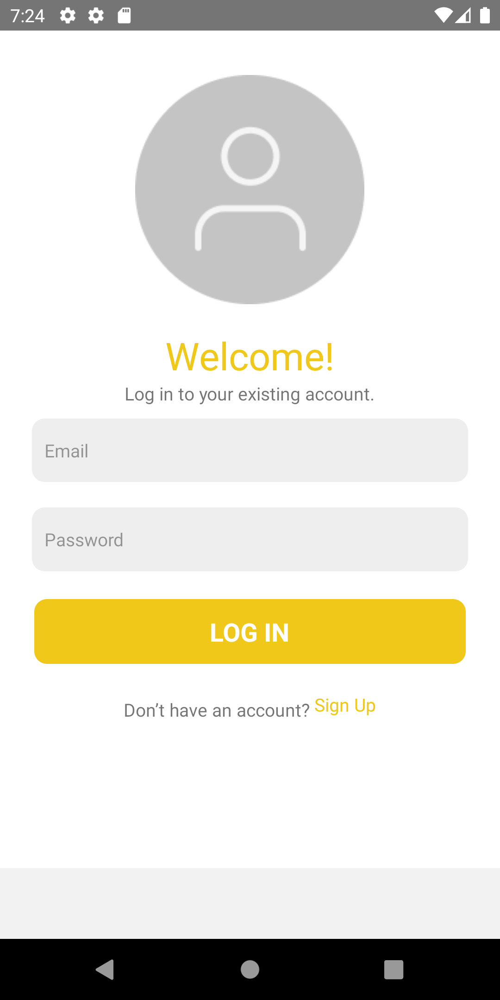
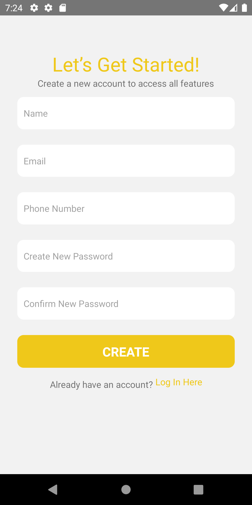
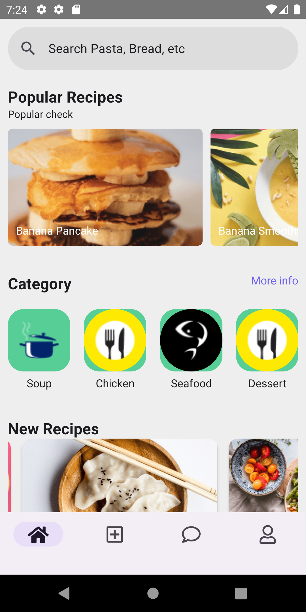
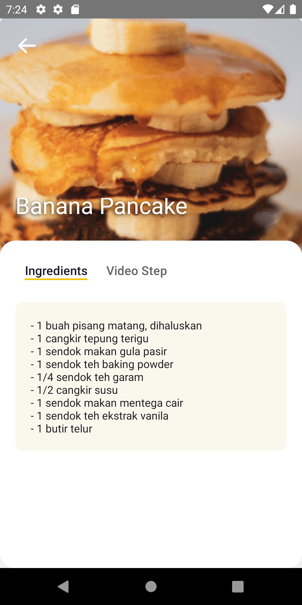

# Food Recipe App Mobile Portfolio 📱🍳🥗

## Project Description 🚀

"Food Recipe" is a mobile app built with React Native. Users can share and discover a variety of recipes, creating a community-driven platform for culinary enthusiasts on the go. Whether you're looking to try new dishes or showcase your own creations, Food Recipe App Mobile has got you covered!

## Technologies Used 💻🛠️

The Food Recipe App Mobile project is built using the following technologies:

- JavaScript
- React Native
- Redux (State management)
- React Navigation (Navigation library for React Native)
- Express (Backend framework)
- Node.Js (JavaScript runtime)

## Project Repository 📂🔗

The frontend repository for this project can be found on GitHub at the following link:
[Food Recipe Frontend Repository](https://github.com/IrhamNfrnda/food-recipe-fe-react)
The backend repository for this project can be found on GitHub at the following link:
[Food Recipe Backend Repository](https://github.com/IrhamNfrnda/food-recipe-be)

## Features ✨🍔🍰

- User authentication and account management
- Recipe sharing and posting
- Recipe discovery through search and categories
- Like, comment, and favorite recipes
- User profile and activity tracking
- Smooth navigation with React Navigation
- State management with Redux
- Server-side logic with Express and Node.Js

## Screenshots 📸

<table>
   <tr>
    <td></td>
    <td> </td>
  </tr>
  <tr>
    <td></td>
    <td> </td>
  </tr>
</table>

## Getting Started 🏁🚀

To set up the Food Recipe App Mobile project locally, follow these steps:

1. Clone the backend repository from the provided link.
2. Install the required dependencies using npm.
3. Set up your database and update the configuration accordingly.
4. Ensure you have Node.js and npm installed on your system.
5. Start the server using the command `npm start`.
6. Clone the frontend repository for the mobile app (if available).
7. Install the required dependencies using npm or yarn.
8. Run the app on an emulator or a physical device using `react-native run-android` or `react-native run-ios`.

## Contributions 🤝🌟

Contributions to the Food Recipe App Mobile project are welcome. If you find any issues or have suggestions for improvements, please feel free to open an issue or create a pull request in the backend repository.

## License 📜📝

This project is licensed under the MIT License - see the [LICENSE](LICENSE) file for details.

## Contact 📞📧

If you have any questions or inquiries regarding this project, feel free to contact me at [irhamnfrnda@gmail.com](mailto:irhamnfrnda@gmail.com).

---

Thank you for exploring the Food Recipe App Mobile portfolio. Enjoy cooking and discovering new recipes with the community! 🍽️👩‍🍳👨‍🍳
